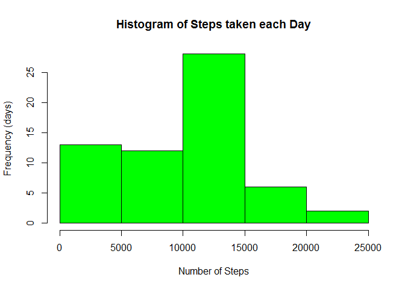
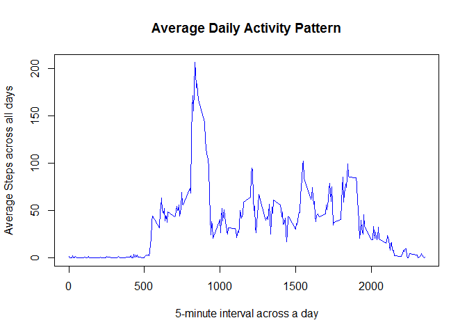
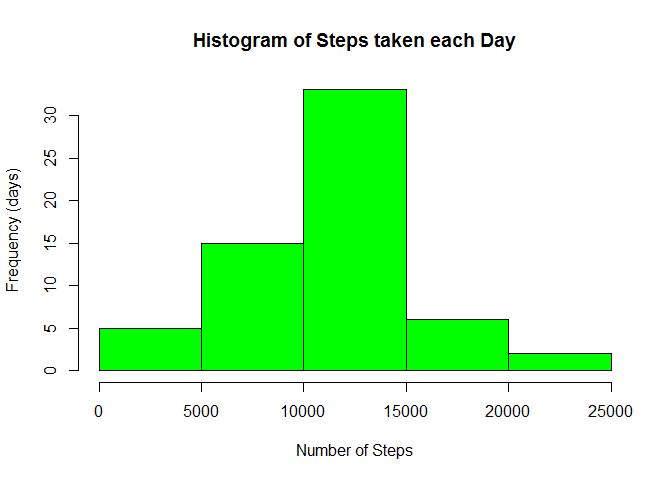
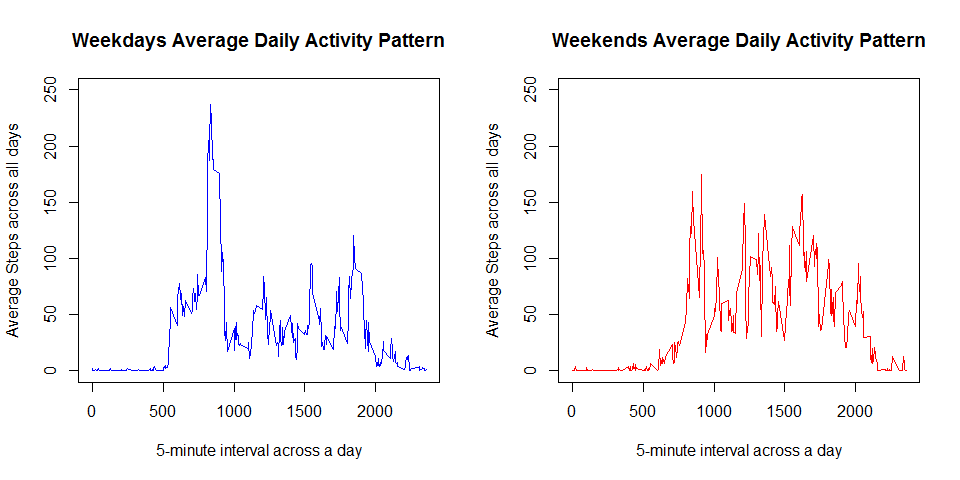

## Reproducible Research Course Project | Week 2 Project 1

This is a submission for the peer-graded assignment in the Coursera's Reproducible Research course. The project consists in writring a report that answers questions given in the assignment.

This assignment makes use of data from a personal activity monitoring device. This device collects data at 5 minute intervals through out the day. The data consists of two months of data from an anonymous individual collected during the months of October and November, 2012 and include the number of steps taken in 5 minute intervals each day.

The script was developed under the following R version and platform:

        R version 4.0.2 (2020-06-22) -- "Taking Off Again"
        Platform: x86_64-w64-mingw32/x64 (64-bit)

---

### Loading and preprocessing the data

**Loading packages that will be used**


```r
library(dplyr)
```

```
## 
## Attaching package: 'dplyr'
```

```
## The following objects are masked from 'package:stats':
## 
##     filter, lag
```

```
## The following objects are masked from 'package:base':
## 
##     intersect, setdiff, setequal, union
```

**Changing the language of the LC_TIME**


```r
Sys.setlocale("LC_TIME", locale="English")
```

**Reading the data**


```r
data <- read.csv("./activity.csv")
```

**Formatting dates**


```r
data$date <- strptime(data$date, format="%Y-%m-%d")
```

**Adding variables**


```r
data$weekdays <- weekdays(data$date, abbreviate=TRUE)
data$typeDay <- NA
data$typeDay[which(data$weekdays %in% c("Mon", "Tue", "Wed", "Thu", "Fri"))] <- "weekday"
data$typeDay[which(data$weekdays %in% c("Sat", "Sun"))] <- "weekend"
data$missing <- is.na(data$steps)
```

### Histogram of the total number of steps taken each day


```r
stepsDay <- tapply(data$steps, as.factor(data$date), sum, na.rm=TRUE)
hist(stepsDay, xlab="Number of Steps", ylab = "Frequency (days)", main = "Histogram of Steps taken each Day", col="green")
```

<!-- -->

### Mean and median number of steps taken each day

**Mean of steps taken each day**


```r
mean(stepsDay)
```

```
## [1] 9354.23
```

**Median of steps taken each day**


```r
median(stepsDay)
```

```
## [1] 10395
```

### Time series plot of the average number of steps taken


```r
dailyPattern <- tapply(data$steps, as.factor(data$interval), mean, na.rm=TRUE)
plot(names(dailyPattern), dailyPattern, type = "l", xlab="5-minute interval across a day", ylab="Average Steps across all days", main="Average Daily Activity Pattern", col="blue")
```

<!-- -->

**Which 5-minute interval, on average across all the days in the dataset, contains the maximum number of steps?**


```r
names(which.max(dailyPattern))
```

```
## [1] "835"
```

The 5-minute interval 835 contains the maximum number of steps on average across all the days in the dataset. 


### Code to describe and show a strategy for imputing missing data

**Calculate and report the total number of missing values in the dataset**


```r
sum(data$missing)
```

```
## [1] 2304
```

The total number of missing values in the dataset is 2304.

**Devise a strategy for filling in all of the missing values in the dataset**

The NAs in the dataset are concentrated in 8 different day across all the intervals of that days. The other 53 days do not contain any missing values.
The strategy that will be used consists in imputting the average 5-minute intervals for each day of the week (excluding NAs) to the days presenting missing values.


```r
imputedData <- data %>% group_by(weekdays, interval) %>% mutate(average=mean(steps, na.rm=TRUE))
NArows <- which(imputedData$missing == TRUE)
imputedData$steps[NArows] <- imputedData$average[NArows]
```

### Histogram of the total number of steps taken each day after missing values are imputed


```r
stepsDay2 <- tapply(imputedData$steps, as.factor(imputedData$date), sum)
hist(stepsDay2, xlab="Number of Steps", ylab = "Frequency (days)", main = "Histogram of Steps taken each Day", col="green")
```

<!-- -->

**Mean of steps taken each day with missing values being imputed**


```r
mean(stepsDay2)
```

```
## [1] 10821.21
```

**Median of steps taken each day with missing values being imputed**


```r
median(stepsDay2)
```

```
## [1] 11015
```

**What is the impact of imputing missing data on the estimates of the total daily number of steps?**

Both the mean and the median of steps taken each day are increased. The shape of the distribution changed. Days in which the number of steps taken were in the ranges of 5000 to 10000 and 10001 to 15000 increased their frequency due to the mising values being imputed.

### Panel plot comparing the average number of steps taken per 5-minute interval across weekdays and weekends


```r
par(mfrow=c(1,2))
imputedData_typeDay <- imputedData %>% group_by(typeDay,interval) %>% summarize(steps=mean(steps))
```

```
## `summarise()` regrouping output by 'typeDay' (override with `.groups` argument)
```

```r
with(imputedData_typeDay[imputedData_typeDay$typeDay=="weekday", ],
plot(interval, steps, type="l", xlab="5-minute interval across a day", ylab="Average Steps across all days", main="Weekdays Average Daily Activity Pattern", col="blue", ylim=c(0,250)))
with(imputedData_typeDay[imputedData_typeDay$typeDay=="weekend", ],
plot(interval, steps, type="l", xlab="5-minute interval across a day", ylab="Average Steps across all days", main="Weekends Average Daily Activity Pattern", col="red", ylim=c(0,250)))
```

<!-- -->
